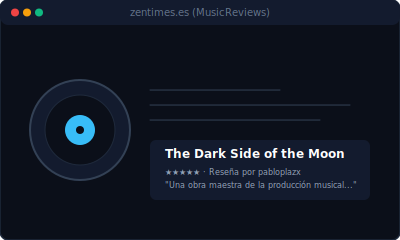

  

  

---

<h3 align="center">🛠️ Stack Tecnológico</h3>

  

---

<h3 align="center">🎯 Proyecto Destacado</h3>

<table width="100%" border="0" cellspacing="0" cellpadding="0">
  <tr style="border: none;">
    <td width="55%" valign="top" style="border: none; padding-right: 20px;">
      <h3>🎵 MusicReviews (TFG)</h3>
      
<samp>Una aplicación web full-stack inspirada en <b>Letterboxd</b> dedicada al análisis y reseña de música. Implementa una arquitectura en capas modular y robusta para garantizar la mejor experiencia y escalabilidad.</samp>

      <ul>
        <li><samp><b>Arquitectura:</b> Capa MVC, Repository Pattern, Service Layer, DTOs y Global Exception Handler.</samp></li>
        <li><samp><b>Seguridad:</b> Autenticación JWT con expiración dinámica y control de acceso robusto con Spring Security.</samp></li>
        <li><samp><b>DevOps:</b> Contenedores en Docker Compose y CI/CD automatizado con GitHub Actions.</samp></li>
      </ul>
       
      

        
        &nbsp;&nbsp;
        
        &nbsp;&nbsp;
        
      

    </td>
    <td width="45%" valign="middle" align="center" style="border: none;">
      
    </td>
  </tr>
</table>

---

<h3 align="center">📈 Actividad & Racha</h3>

  
  &nbsp;&nbsp;
  
  &nbsp;&nbsp;
  

  

---

<h3 align="center">📬 Conectar</h3>

  
  &nbsp;&nbsp;
  

